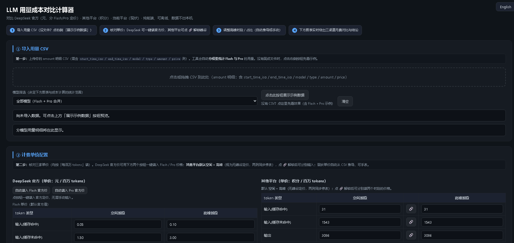
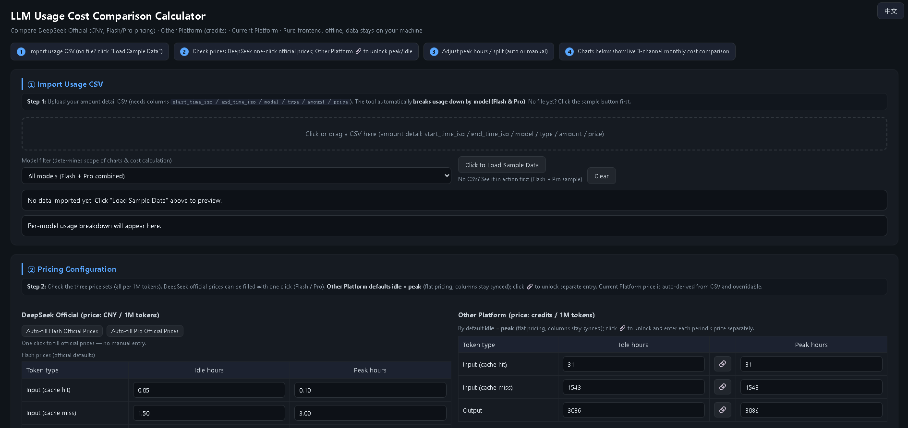
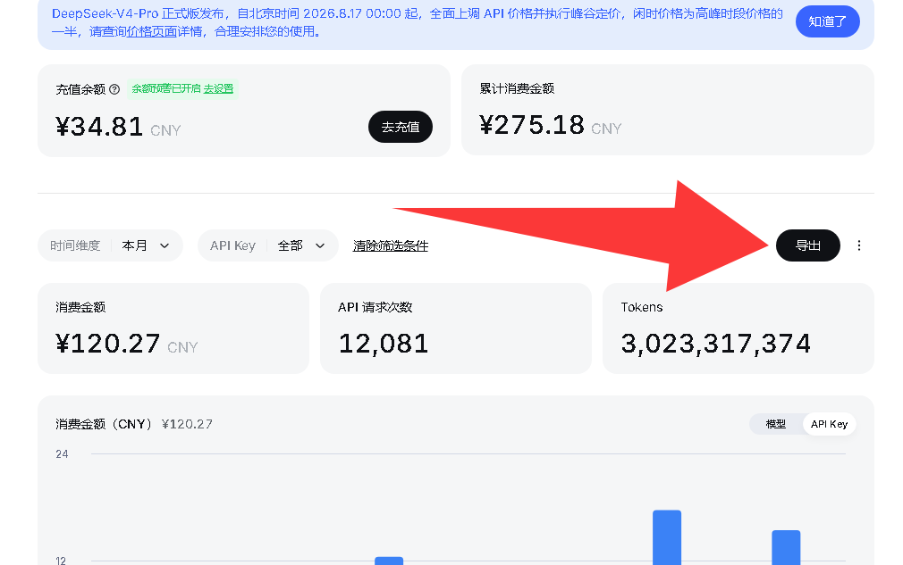

# LLM Usage Cost Comparison Calculator

  

Compare the monthly cost of **DeepSeek Official** (CNY / 1M tokens, with separate Flash / Pro pricing) against any **credit-based platform** (credits / 1M tokens). The tool auto-derives the peak/idle usage split from your usage CSV via an hourly distribution method, and produces a live three-channel monthly cost comparison with a clear cheapest-option callout.

- Pure-frontend single-file HTML, works offline, data never leaves your machine
- Automatically breaks usage down by model — Flash vs Pro
- One-click fill of DeepSeek Flash / Pro official prices
- Other Platform defaults to `idle = peak` (synced); click 🔗 to unlock separate entry
- Chinese / English bilingual UI (toggle in the top-right corner)
- Export results to CSV / JSON

## Screenshots

### 中文界面 / Chinese UI

### English UI

## Usage

1. Export your **DeepSeek Console** usage detail CSV — click the **「导出 / Export」** button on the console:

   

2. Double-click `LLM成本对比计算器.html` and click **「Click to Load Sample Data」** to preview.

3. **Drag your CSV** into the page (or click the drop area). The tool auto-segregates Flash vs Pro per model.

4. Tweak DeepSeek / Other Platform prices (or one-click the official prices), peak hours, and the credit-to-CNY conversion.

5. Review the **monthly cost comparison** and **detail tables** at the bottom, and export.

## Algorithm

- Each row's `amount` is spread hour-by-hour over `[start, end)`; hours falling inside the peak window count toward peak → automatic peak/idle split.
- Weighted unit price = `idle_share × idle_price + peak_share × peak_price`.
- Monthly usage = period usage × `30 / days_covered`.
- DeepSeek cost = `Flash_tokens × Flash_price + Pro_tokens × Pro_price` (matched by model name).
- Other Platform cost = total tokens × credit price × `1_credit = X_CNY`.

## Files

- `LLM成本对比计算器.html` — main program (single file, no dependencies)
- `HTML界面中文.png` / `HTML界面英文.png` — UI screenshots
- `导出csv教程图.png` — How to export the CSV from the DeepSeek console

## License

MIT
